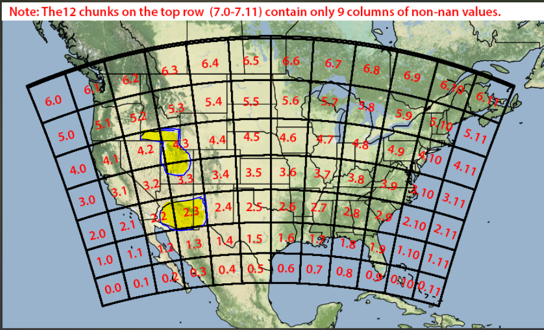
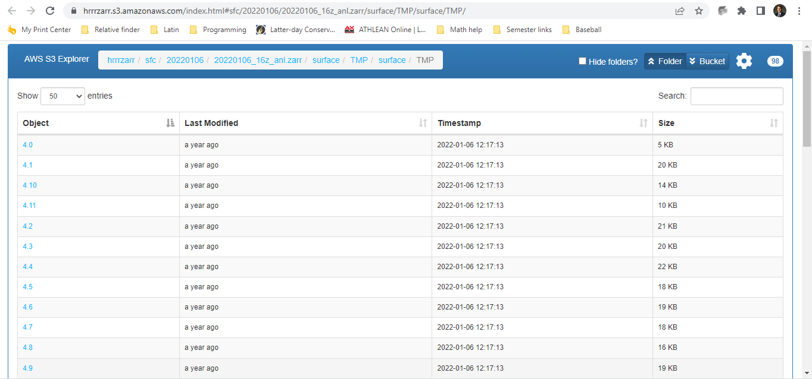

```{r, include = FALSE}
knitr::opts_chunk$set(
  collapse = TRUE,
  comment = "#>"
)
```

```{r setup, echo = FALSE}
pacman::p_load(stotzgdh)
```


# Website

Data is being pulled from National Oceanic and Atmospheric Administration (NOAA) through Amazon. The link to the data can be found here: https://aws.amazon.com/marketplace/pp/prodview-yd5ydptv3vuz2#resources

From the website, "The HRRR is a NOAA real-time 3-km resolution, hourly updated, cloud-resolving, convection-allowing atmospheric model, initialized by 3km grids with 3km radar assimilation. Radar data is assimilated in the HRRR every 15 min over a 1-h period adding further detail to that provided by the hourly data assimilation from the 13km radar-enhanced Rapid Refresh."

# Areas of Focus




- This picture shows the grids that NOAA captures temperature data per hour. It also shows the areas of interest for stotz through the highlighted portions of the picture. 


# Retrieval Process

By going to this url: https://hrrrzarr.s3.amazonaws.com/index.html#sfc/20220106/20220106_16z_anl.zarr/surface/TMP/surface/TMP/

You will be browsing the S3 bucket Amazon stores the data in. As seen below:



- The numbers under the object column correspond to the grid numbers in the picture above.

Each file is one hour of data. Our package is designed to go in and retrieve all files for specified date range that is provided in a csv. 

## More detail 

Because we are only interested in the highlighted regions of the grid we are able to filter down the grid files to the latitude and longitude we desire. We then combined them all together, convert the temperatures from Kelvin to Fahrenheit and calculate the Growing Degree Hours where we aggregate on a day to get Growing Degree Days.

We take the csv provided by Stotz and return the daily Growing Degree Days for a day over the specified date range for a Latitude and Longitude of a field and specific crop of interest. 


